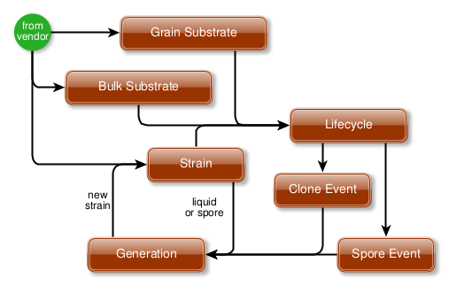

## [Huautla](https://github.com/jsmit257/huautla)
Named after the town in Jiménez that was the bridge between native traditions and what qualifies as a modern understanding of psychedelics. There's an interesting story of people and politics behind their noteriety, so like any memorial, this is a nod to what we consider to be a remarkable moment in history.

### Overview
The goal of this project is to track analytics observing the lifecycle of fungi. There's a lot more to consider before we could call this list of attributes comprehensive for many fungi, but for now we've captured the few events that cover most of our needs. Even this highly abstract overview of a colony over time is missing many species-specific attributes. We'll continue to evolve the analytics as we encounter more distinct charecteristics.

More details of a lifecycle are described in the [object model](#object-model), but at a higher level, lifecycles evolve through some of the following 4 stages:

* Gestation: These are the range of events between culturing spores, and having a live colony in stasis, so to speak, that's ready to be introduced to an environment that can support growth to the point of procreation. Simply and roughly put, this is the time between a spore-print, and life outside of sugar-water
* Colonization: Maybe 'adolescence' is a better name. Probably sealed in a bag of grain(s), woodchips or ???, this is when cosmopolitan organisms establish a colony, share resources, build strong contamination resistance - all in the safety of closed bubble.
* Majority: This is when the colony is established and strong and can grow to the excess needed to fruit new generations. An example is mixing colonized adolescents from the previous stage with porous, moist, nutritive bulk substrate in a bed. They can consume much more than the colony needs, so the extra will be used for procreation.
* Vacation: A sort of suspended animation when a fungus is ahead of schedule and needs to stop working. Fortunately, they chill well with minimal damage, and simply wake up when they get warm again. So time spent on `Vacation` within a lifecycle isn't fully counted into a normal temporal model for a particular strain, but it still needs to be predictable in terms of how long they can chill, and whether they end with fruits, or the colony dies.

### Requirements
To develop and test locally, you'll need at least:
* Git (you only need an account if you plan to change anything)
* Golang environment
* docker/docker-compose (sometimes they're packaged separately, get both)
* postgres-client (optional) if you'd like to query the running container from localhost, for debugging, etc
* postgres-server (optional) if you want to work/test on a local database like one that you use for other things, with scheduled backups, etc; see [Docker](#docker) alternatives to a local server
* `make` probably a GNU-compatible one
* bash-compatible shell (bourne doesn't handle arrays nicely); changing this would require other users to use your shell, so we prefer `bash`; `zsh` is ubiquitous, but `tcsh` is a bit much

### Docker
The only build artifacts from this project are the docker images at [dockerhub](https://hub.docker.com/repository/docker/jsmit257/huautla/general). Proper semantic/commit-sha versioning isn't currently supported, but there will always be at least `...:lkg` (last-known good) and `...:lts` (long-term-support) versions. Last-known good is tagged when `make install-system-test` successfully seeds the test data. LKG is pushed to the remote as `jsmit257/huautla:lkg` after `make system-test` succeeds.

Only the minimal seed data is captured in the image, the test data is lost when the test container exits. 

TODO: webhook with github/et al.

### Scripts
Some of the scripts in [bin](./bin/) are meant to run locally (regardless of whether postgres runs locally), and others are meant to run from inside the docker container (although they may also run locally). All scripts accept the same environment variable _patterns_ that differ in prefix but serve the same general purpose. For instance, backup requires `SOURCE_*` variables for `*_HOST`, `*_POST`, etc, while restore requires `DEST_*` prefixes. Migration, of course, requires both. In the case of local create/init scripts that only connect for writing, the prefix is `POSTGRES_`. The patternized names and their meanings are listed below:

- `*_HOST`: (required) data source hostname; typically, the hostname of a vanilla instance of `jsmit257/huautla:lkg` or similar as defined in a `docker-compose.yml`
- `*_PORT`: (optional, default:5432) postgres port on the source host
- `*_USER`: (optional, default:postgres) user with admin privileges on the source server
- `POSTGRES_PASSWORD`: (required) password for the postgres user(s). This is rarely used and may not be needed where it is used. Most importantly there is currently no differentiation between SOURCE and DEST passwords. Nonetheless, attempt to avoid saving this anywhere including command history if it's at-all sensitive

Only three local scripts are interesting unless you're fixing something:
- [install prod](./bin/install-prod.sh) creates the database, creates roles and permissions, creates tables/triggers/functions, seeds production data (a few necessary values) and exits
  ##### required parameters:
    - `POSTGRES_HOST`, `POSTGRES_PORT`, `POSTGRES_USER`, `POSTGRES_PASSWORD`
- [install system test](./bin/install-system-test.sh) calls `install-prod.sh`, then loads additional data expected by [system tests](./tests/system/)
  ##### required parameters:
    - `POSTGRES_HOST`, `POSTGRES_PORT`, `POSTGRES_USER`, `POSTGRES_PASSWORD`
- [system test](./bin/system-test.sh) runs the `go` system tests; it does *not* run any prerequisites
  ##### required parameters:
    - `POSTGRES_HOST`, `POSTGRES_PORT`, `POSTGRES_USER`, `POSTGRES_PASSWORD`

All the above have `make` targets that run the right things with sane defaults, in the right order, and fail at the right time, so generally prefer those over running the scripts manually.

Additional entrypoints are also packaged in the image for the purpose of persistence management. Reference implementations for all the following features are documented in [cffc standalone](https://github.com/jsmit257/centerforfunguscontrol/blob/master/standalone/docker-compose.yml). The scripts themselves have descriptive errors, where possible.

- [migration](./bin/migration-entrypoint.sh): moves data from a source to a destination. In the reference implementation, the source is the minimally pre-seeded huautla database, and the destination is a short-lived empty database with a volume mounted from the host - hence, persistent. This should only be run once - the service issues appropriate errors for troubleshooting.
  ##### required parameters:
    - `SOURCE_HOST`, `SOURCE_PORT`, `SOURCE_USER`, `DEST_HOST`, `DEST_PORT`, `DEST_USER`

  The product of this execise is a `data/` directory suitable for mounting as a volume in a simple `golang:latest` container.

- [backup](./bin/backup-entrypoint.sh): archives a running instance to the `/pgbackups` directory. This is mostly only useful if that directory is mapped to a persistent volume.
  ##### required parameters:
    - `SOURCE_HOST`, `SOURCE_PORT`, `SOURCE_USER`, `POSTGRES_PASSWORD`
  ##### additional parameters:
    - `BACKUP_DIR`: (optional) used when this script is run outside a container; default is '/pgbackup'. Directory must exist on the host, or the command fails.

- [restore](./bin/restore-entrypoint.sh): restores an archive to a running instance of the huautla database This is mostly only useful if that directory is mapped to a persistent volume.
  ##### required parameters:
    - `DEST_HOST`, `DEST_PORT`, `DEST_USER`, `POSTGRES_PASSWORD`
  ##### additional parameters:
    - `BACKUP_DIR`: (optional) used when this script is run outside a container; default is '/pgbackup'. Directory must exist on the post, or lthe command fails.
    - `RESTORE_POINT`: (required) one of the archives created by the backup script. See the reference implementation for a description of this parameter

### Local Database
If all you're after is installing a new huautla database to a local server, the [install prod](./bin/install-prod.sh) script can run standalone to create and seed the DB. Unlike migration, this reads DDL and DML directly from scripts. Run it as `$PROJ_ROOT/bin/install-prod.sh` or relative paths in the script will fail. See [vars](./bin/vars.sh) for variable names and defaults.

This only works correctly if the `huautla` database doesn't exist. 

### Using
Public bindings are consolidated in the [api](./types/api.go) and [data types](./types/data.go).

### [Object Model](docs/orm.png)
This image is not a 1:1 mapping to [database tables](./sql/init.sql), but it accurately describes the objects in the public API: 


Then, this simplified version shows specifically the cycle in the graph where generations create new strains: 



### Configuring
Basically, fill out this form and submit it to `huautla.New()`, along with a logger.
```go
Config struct {
  PGHost string
  PGUser string
  PGPass string
  PGPort uint
  PGSSL  string
}
```
There's a workable reference implementation in the system test [init()](./tests/system/main_test.go) function. The SSL field exists for testing with `postgres:bookworm` (and probably others) who don't ship with SSL enabled by default.

### Testing
- `make unit` obviously handles the unit-testing - i.e. how the persistence-bindings respond to cretain all possible events from the database server
- `make system-test` stops any running postgres docker service; runs the unit tests, builds a new database with production seed-data, loads additional/ephemeral test data, then runs [system tests](./tests/system) against the docker container to veryfy basic CRUD opeartions, including all possible errors thrown from the database, and referential- or other integrity-constraints violations. An `huautla/lkg` image is tagged after sample data is loaded (since that's part of the test), but the test data is not persisted in the image.l

### Contributing
Please do!!! The (forthcoming) [license](./LICENCE.md) is open and free with attribution.